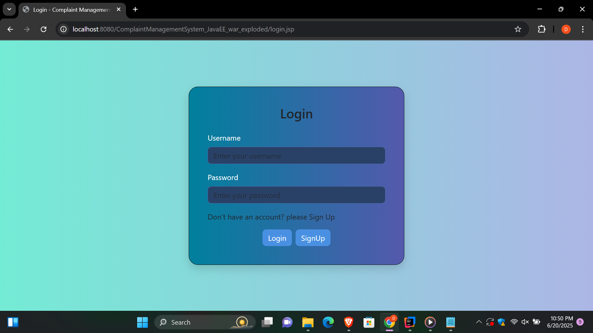
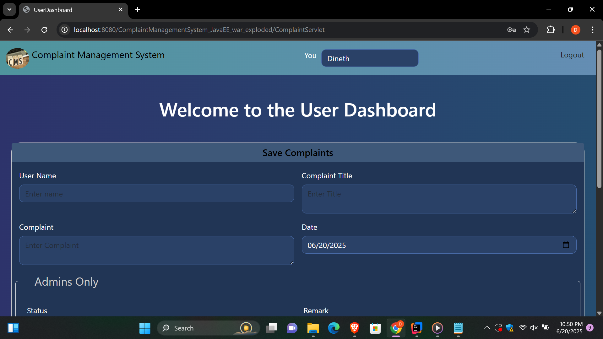
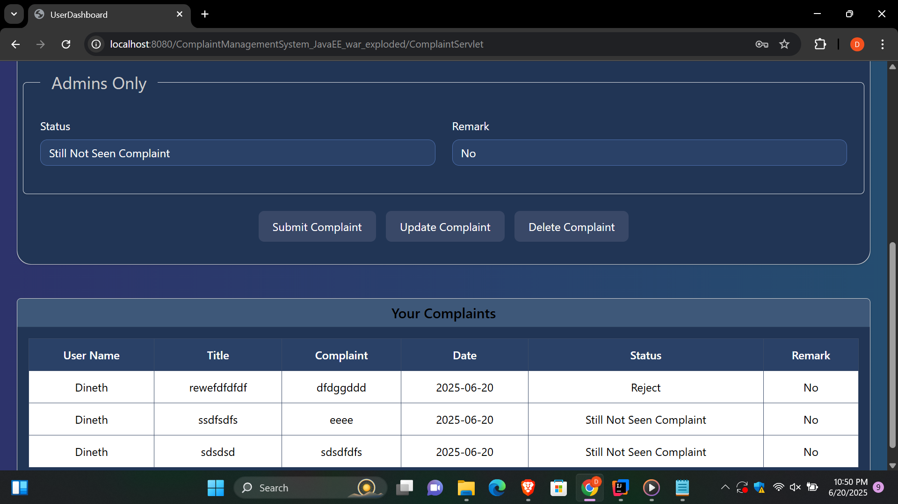
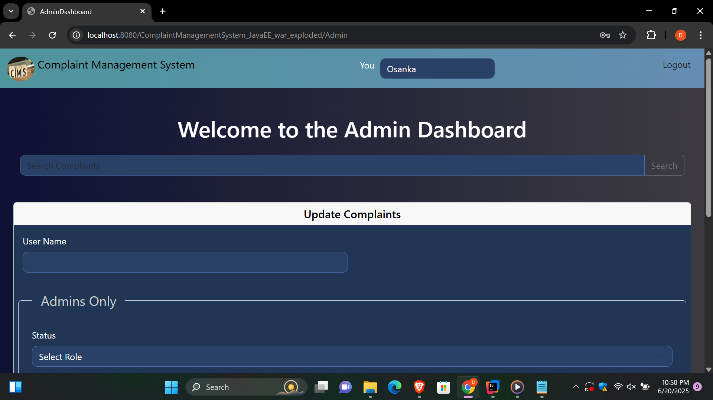
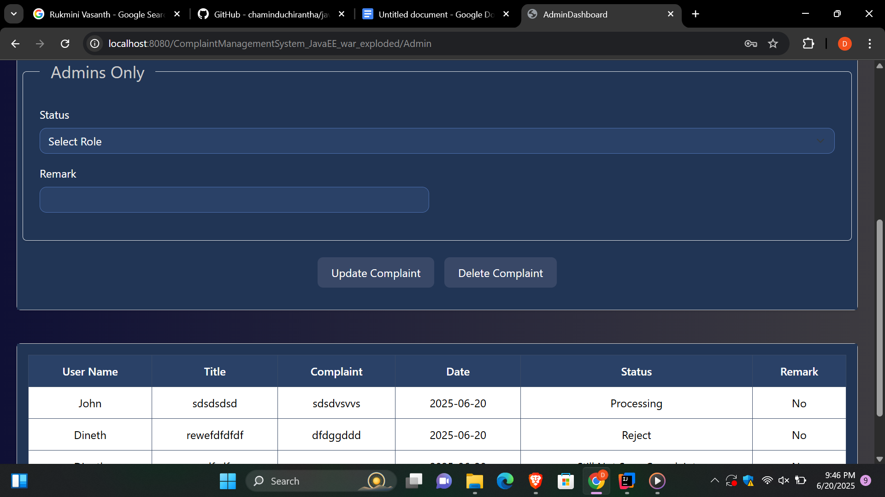

Complaint Management System (CMS)
Project Overview
The Complaint Management System (CMS) is a web-based application designed for internal municipal use. It allows employees to submit and track complaints, and administrators to manage complaint resolutions. It developed using JSP, Servlets, and JDBC under the MVC architecture.
This application allows users to log complaints, view complaint history, and for admins to manage those complaints. It uses a fully synchronous request-response cycle with form-based input

User Roles

- **Employee**
  - Login via session-based authentication
  - Submit new complaints
  - View own complaints
  - Edit/delete complaints before resolution

- **Admin**
  - Login via session-based authentication
  - View all complaints
  - Update complaint status and add remarks
  - Delete any complaint

 Technology Stack

| Component      | Technology                |
|----------------|---------------------------|
| Frontend       | JSP, HTML, CSS,JavaScript |
| Backend        | Jakarta EE (Servlets)     |
| Database       | MySQL                     |
| Connection Pool| Apache Commons DBCP       |
| Deployment     | Apache Tomcat (local)     |

Application Architecture (MVC)

JSP files act as the View – they handle UI rendering and collect input via HTML forms.
Servlets act as the Controller – they receive HTTP requests from JSPs, process logic, call models, and decide which view to display next.
DAO and DTO classes act as the Model – they manage the data, perform database operations, and carry data between layers.

 Folder Structure

```plaintext
ComplaintManagementSystem-JavaEE/
├── src/main/java/lk/ijse/gdse/
│   ├── controller/           # Servlet Controllers
│   ├── dao/                  # DAO Interfaces
│   │   └── impl/             # DAO Implementations
│   ├── dto/                  # DTO (JavaBeans)
│   └── db/                   # DB connection pool
│
├── webapp/
│   ├── WEB-INF/web.xml       # Servlet config
│   ├── assets/               # Static files (CSS, images)
│   │   ├── css/
│   │   └── images/
│   ├── AdminDashboard.jsp
│   ├── login.jsp
│   ├── MainDashboard.jsp
│   ├── SignUp.jsp
│   ├── UserDashboard.jsp
│
├── README.md
└── pom.xml                   # Maven dependency management
```

Setup & Configuration Guide

Prerequisites

- JDK 17+
- Apache Tomcat 10+
- MySQL Server
- Maven or manual dependency setup
- IntelliJ

Author
Dineth Osanaka Nakandala

YouTube this project - https://youtu.be/GnBgZuMiFZ0

### 🔹 Main Dashboard View  
.png)

### 🔹 Login Page  


### 🔹 SignUp Page  


### 🔹 User Dashboard  


### 🔹 User Dashboard Table  


### 🔹 Admin Dashboard  


### 🔹 Admin Dashboard Table  



 

